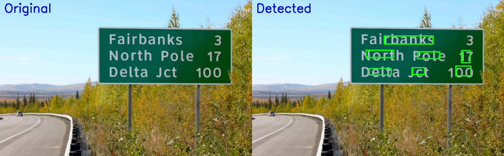

# Text Detection Project

This project demonstrates text detection using an EAST (Efficient and Accurate Scene Text detection) model and TensorFlow Lite for efficiency.

## Overview

The repository is equipped with scripts and models specifically for detecting text in images. It utilizes the EAST model to identify text regions, which are then accentuated using rectangular boxes. This approach is highly effective in various applications like document scanning and image-based text extraction, but also in red-light cameras for license plates.

## Requirements

Before you get started, ensure you have the following requirements installed on your system:

- Python 3.11
- TensorFlow Lite
- OpenCV
- Matplotlib

## Installation

Follow these steps to set up and run the text detection project:

1. Clone the GitHub repository containing the EAST text detection algorithm:

    ```bash
    git clone https://github.com/dilhelh/opencv-text-detection.git
    ```

2. Run the EAST text detection script with your image:

    ```bash
    python /content/text-detection-opencv-east/opencv_ocr_image.py --image /content/text-detection-opencv-east/images/sign.jpg \
        --east /content/text-detection-opencv-east/frozen_east_text_detection.pb
    ```

    Note: You may need to install additional dependencies, such as 'pytesseract,' for text recognition.

3. Convert the EAST model to TensorFlow Lite format with quantization:

    ```bash
    # Download and extract a subset of the COCO-Text dataset for quantization
    wget -q https://github.com/sayakpaul/Adventures-in-TensorFlow-Lite/releases/download/v0.11.0/coco_text_100.tar.gz
    tar xf coco_text_100.tar.gz

    # Prepare the representative dataset for quantization
    IMAGE_LIST = list(paths.list_images('/content/coco_text_100'))
    IMG_SIZE = 320

    # Run the representative dataset generation script
    python generate_representative_dataset.py

    # Convert the EAST model to TensorFlow Lite format with quantization
    python convert_to_tflite.py
    ```

4. Run inference on your preprocessed image:

    ```bash
    python inference.py --image /path/to/your/image.jpg
    ```

5. Check the output for detected text regions and bounding boxes.

## Example



