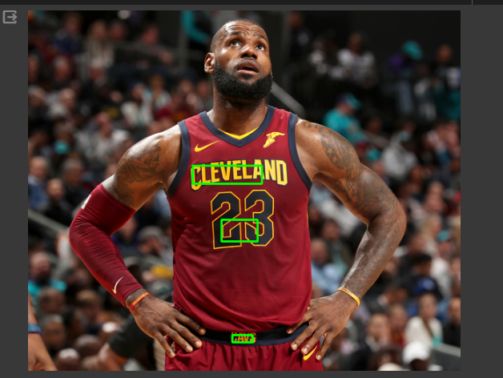

# Text Detection Project

This project demonstrates text detection using an EAST (Efficient and Accurate Scene Text detection) model and TensorFlow Lite for efficiency. 

## Overview

The repository contains scripts and models for text detection on images. The EAST model is used to detect text regions, and the detected text is highlighted with rectangular boxes. 

## Requirements

- Python 3.11
- TensorFlow Lite
- OpenCV
- Matplotlib

Example: 
