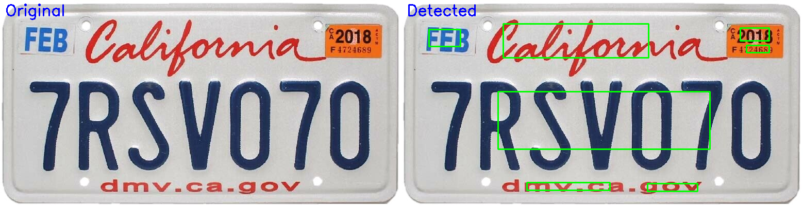
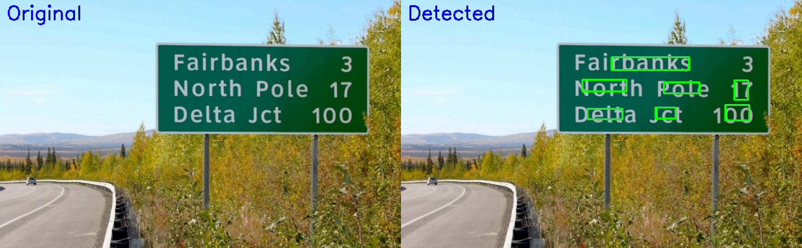
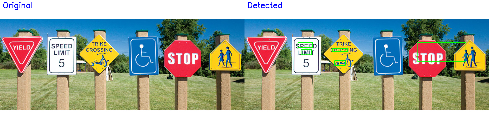

# Text Detection Project

This project demonstrates text detection using an EAST (Efficient and Accurate Scene Text detection) model and TensorFlow Lite for efficiency.

## Overview

The repository is equipped with scripts and models specifically for detecting text in images. It utilizes the EAST model to identify text regions, which are then accentuated using rectangular boxes. This approach is highly effective in various applications like document scanning and image-based text extraction, but also in red-light cameras for license plates.

## Requirements

Before you get started, ensure you have the following requirements installed on your system:

- Python 3.11
- TensorFlow Lite
- OpenCV

## Installation

Follow these steps to set up and run the text detection project:

1. Clone the GitHub repository containing the EAST text detection algorithm:

    ```bash
    git clone https://github.com/dilhelh/opencv-text-detection.git
    ```

2. Run the EAST text detection script with your image:

    ```bash
    python /content/opencv-text-detection/text_detection.py --image /content/opencv-text-detection/images/sign.jpg \
	--east /content/opencv-text-detection/frozen_east_text_detection.pb
    ```

3. **Convert the EAST model to TensorFlow Lite format with quantization:**

    ```bash
    # Download and extract a subset of the COCO-Text dataset for quantization
    wget -q https://github.com/sayakpaul/Adventures-in-TensorFlow-Lite/releases/download/v0.11.0/coco_text_100.tar.gz
    tar xf coco_text_100.tar.gz

    # Prepare the representative dataset for quantization
    **python pre_processing.py**

    # Run the representative dataset generation script
    **python perform_inference.py**

    # Convert the EAST model to TensorFlow Lite format with quantization
    **python post_processing.py**
    ```

4. **Check the output for detected text regions with light-green boxes:**

    ```bash
    python combine_and_label_images.py
    ```

    This will show images and results side by side.

## Examples

### License Plate Text Detection

- In this example, the text detection model successfully identifies and highlights license plate regions, showcasing its applicability in tasks such as license plate recognition for traffic monitoring or automated toll collection.



### Other Examples

- Highway Signs Example

  

- Multiple Signs Example
  - The model handles scenarios with multiple signs, some featuring text and others without.

  

### No Text Example

In scenarios where there is no text, the model demonstrates its ability to handle such cases.


